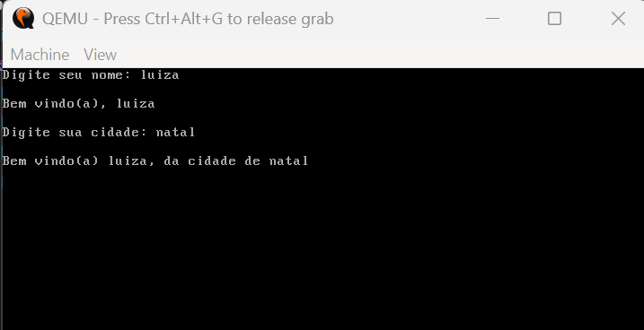

# Bootloader Interativo em Assembly (x86 - Real Mode)

Este projeto apresenta um **bootloader simples, funcional e interativo**, escrito em Assembly para arquitetura x86 e projetado para ser executado diretamente pela BIOS, sem nenhum sistema operacional instalado.

## Introdução

Um **bootloader** é o primeiro código executado por um computador logo após o processo de inicialização da BIOS. Ele normalmente carrega o sistema operacional na memória, mas também pode ser usado para executar pequenos programas autônomos — como este.

Nesta atividade, desenvolvemos um bootloader que:
1. Exibe uma mensagem pedindo o **nome do usuário**
2. Dá as boas-vindas com o nome digitado
3. Solicita a **cidade de origem**
4. Exibe uma mensagem final combinando nome e cidade

O bootloader foi escrito com menos de 512 bytes, utilizando apenas **Assembly em modo real**, **interrupções da BIOS** (`INT 10h` para vídeo e `INT 16h` para teclado) e um pequeno buffer de memória.

## Execução

### Requisitos:

- [NASM](https://www.nasm.us/) (montador x86)
- [QEMU](https://www.qemu.org/) (emulador de máquina)
- Terminal `MSYS2 MinGW64` no Windows (ou Linux/Mac com terminal padrão)

### Passo a passo:

1. Compile o código com NASM:

```bash
nasm -f bin bootloader.asm -o bootloader.bin
```

2. Rode com QEMU:

```bash
qemu-system-i386 -drive format=raw,file=bootloader.bin
```

## Exemplo visual da aplicação




## Conclusão

Esta atividade permitiu compreender, na prática, o funcionamento da arquitetura x86 em baixo nível, além do ciclo de boot de um computador real. Trabalhar diretamente com registradores, buffers, interrupções e o modo real da BIOS proporciona uma experiência única de aprendizado, revelando o que realmente acontece antes mesmo do sistema operacional iniciar.

Além disso, o uso de QEMU e NASM mostrou como é possível simular um ambiente de execução real com precisão, de forma leve e multiplataforma.

Este bootloader é um ótimo ponto de partida para expandir o conhecimento em sistemas operacionais, BIOS, inicialização de hardware e desenvolvimento bare-metal.

Vale destacar que, além dos requisitos básicos da atividade — ler uma entrada e exibir uma frase —, o projeto foi expandido para permitir múltiplas interações com o usuário (nome e cidade), utilização de funções reutilizáveis em Assembly, organização modular do código, documentação detalhada e um README completo com captura de execução. Essas adições reforçam o aprendizado prático e aprofundam a experiência com desenvolvimento em nível de hardware.
